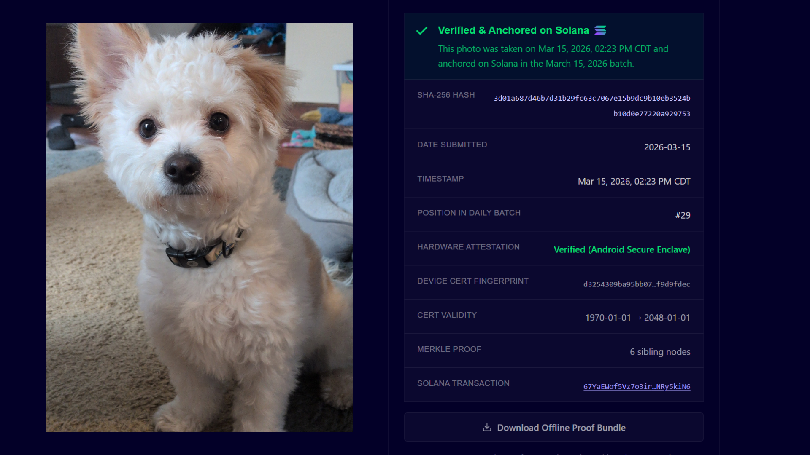
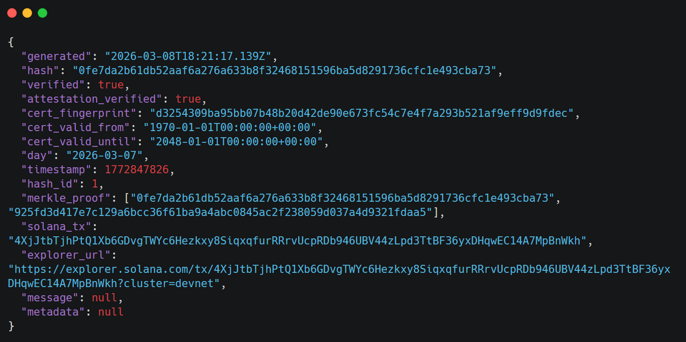
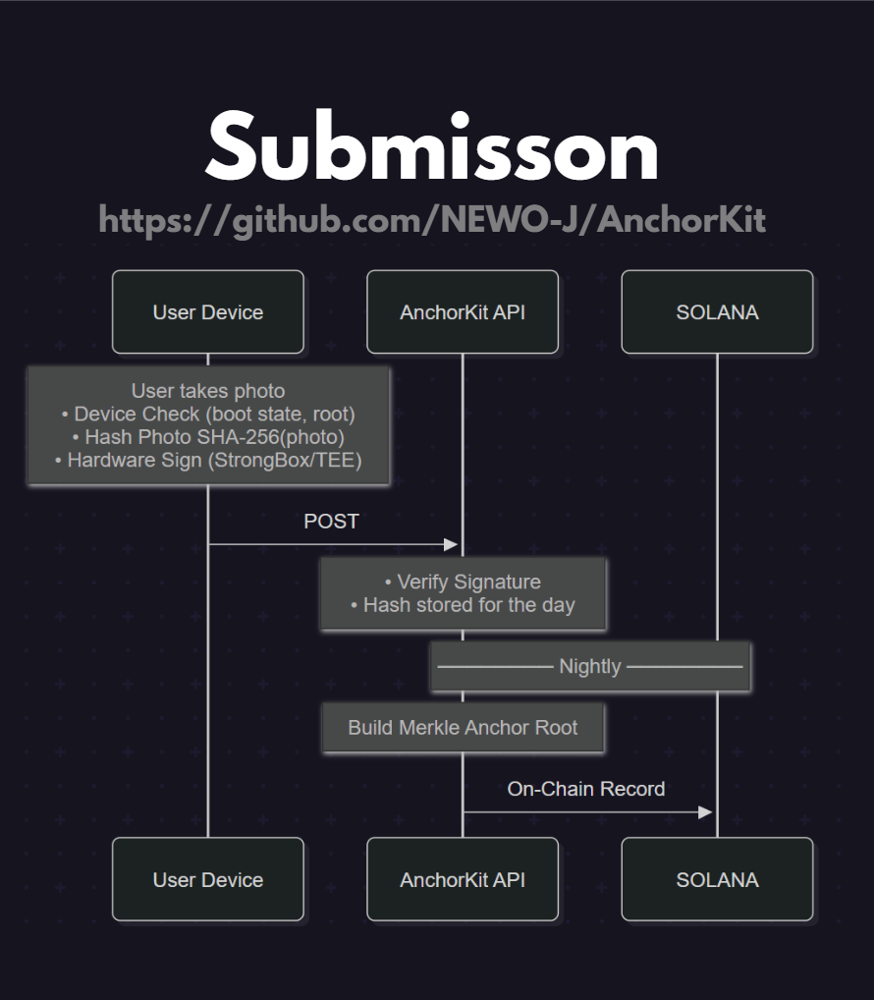
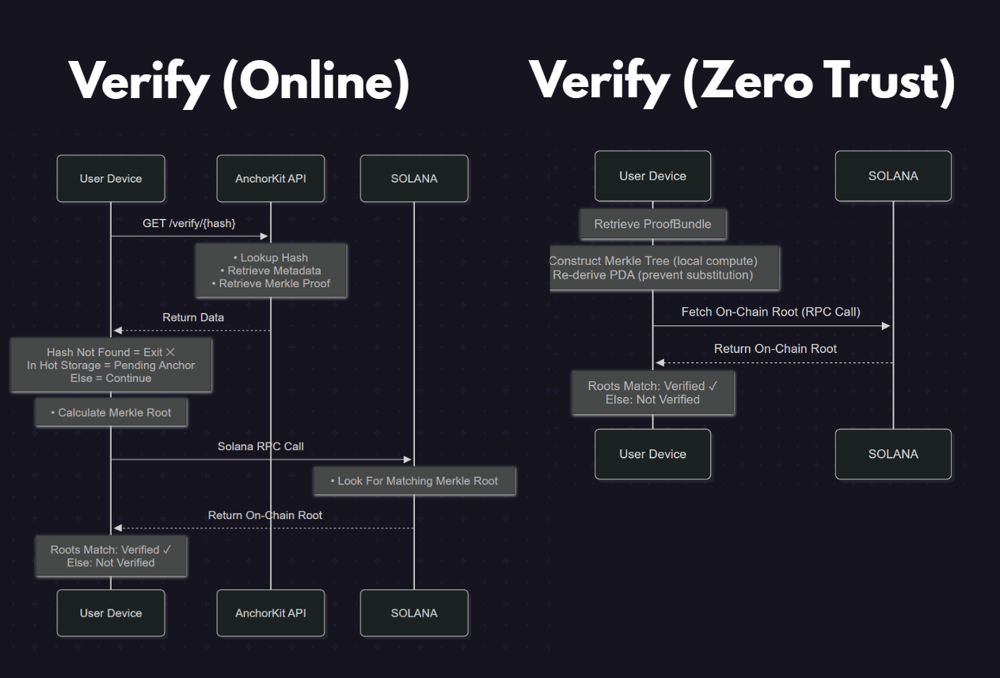

<p align="center">
  
</p>

<p align="center">
  
  
  
  
  
</p>

**AnchorKit** is a photo provenance SDK for Android (*with iOS support coming soon*). It enables applications to distinguish real camera captures from AI-generated or manipulated media using hardware-backed cryptographic proofs.
<p align="center">
  <a href="#how-it-works">How It Works</a> •
  <a href="#anchor-demo">Demo</a> •
  <a href="#quick-start">Quick Start</a> •
  <a href="#installation">Installation</a> •
  <a href="#credits">Credits</a> •
  <a href="#license">License</a> •
  <a href="https://anchorkit.net">AnchorKit.net</a>
</p>

## What It Does


- AnchorKit integrates with your existing CameraX pipeline via a single API call — no camera rewrites required.
- All media captured is hardware attested using **secure hardware enclave** (TEE), then sent to the backend.
- Each night, submissions are aggregated into a daily Merkle tree, and the root hash is anchored to the Solana blockchain.
- Proof bundles are **fully** self-contained. Media remains independently verifiable without relying on AnchorKit, AWS, or any other third party.
- Verification requires only the proof bundle and a single Solana RPC call.
> [!NOTE]
> None of your photos or videos are stored within, or sent to AnchorKit, only 32 byte hash representations.

## How It Compares
| Property | C2PA | Truepic Lens | IPTC Metadata | Numbers Protocol | AnchorKit |
| --- | --- | --- | --- | --- | --- |
| **Signing environment** | Any software or HSM with C2PA credential | TEE (Qualcomm) | None | Any software | TEE or StrongBox on capture device |
| **Hardware key generation enforced** | No | Yes | No | No | Yes — origin = GENERATED enforced |
| **Verified boot enforced** | No | Not independently verifiable | No | No | Yes — verifiedBootState = Verified enforced |
| **Post-capture signing possible** | Yes | No | Yes | Yes | No — nonce expires in 5 min |
| **Attestation CA** | C2PA-accredited CA (operator-controlled) | Truepic CA | None | None | Google attestation root CA |
| **Blockchain anchoring** | No | No | No | Yes (Ethereum-compatible) | Yes (Solana mainnet) |
| **Offline verification** | No — requires centralised service | No — requires Truepic service | No | Partial | Yes — SHA-256 + Solana RPC only |
| **Strippable by image processing** | Yes — manifest embedded in file | Yes — C2PA manifest | Yes | No — hash-based | No — hash-based |
| **Retroactive forgery after key compromise** | Yes — can backdate manifests | Yes | N/A | Yes | No — past blockchain records are immutable |


## Anchor Demo
- Insert GIF here - 
> [!NOTE]
> The demo app is rate-limited, for full usage of AnchorKit, you can register for a free API key and integrate it into your application.


## ProofBundles - Zero Trust Verification


> [!CAUTION]
> AnchorKit makes no verification that the **subject matter** of a photo is real,
> anyone can simply take a photo of another photo, and this is technically valid.
> Videos are much more resillient to this attack, this is where AnchorKit excels.
> In this situation, supplmentary tools can be used to analyze the images for parallax, moire pattern, etc.

## How It Works




> [!IMPORTANT]
> Its important that AnchorKit is **not** treated as an arbiter of truth.
> It does make it exceedingly difficult for AI images to pose as legitimate media,
> but its only supplmentary information, everything you see should be taken with a healthy amount of skepticism.
> 
## Installation

**1. Add JitPack to your project's `settings.gradle`:**

```gradle
dependencyResolutionManagement {
    repositories {
        google()
        mavenCentral()
        maven { url 'https://jitpack.io' }
    }
}
```

**2. Add the dependency in your app's `build.gradle`:**

```gradle
dependencies {
    implementation 'com.github.newo-j.anchorkit:anchorkit-android-sdk:v1.0.1'
}
```

**3. Get a free API key at [anchorkit.net](https://anchorkit.net) and initialise the SDK:**

```kotlin
AnchorKit.init(
    context = applicationContext,
    apiKey  = "your-api-key"
)
```
